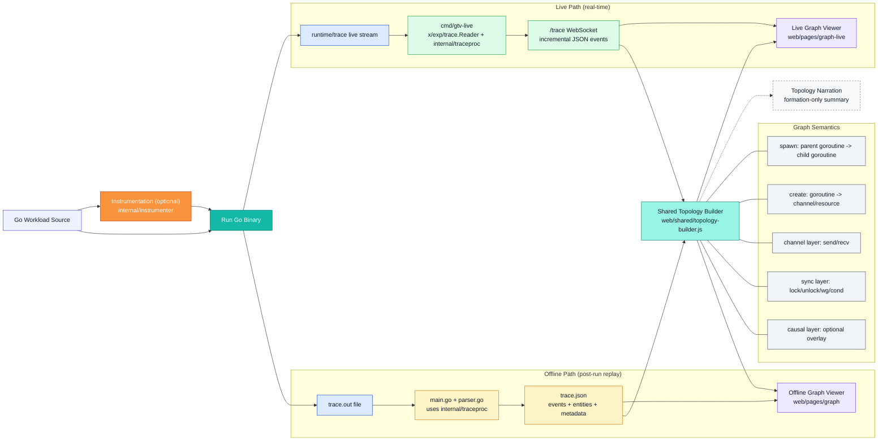

# Go Trace Visualizer (GTV)

## Summary

**Go Trace Visualizer (GTV)** is a synchronization-aware visualization and analysis system for Go concurrency. It instruments workloads, processes `runtime/trace` data through a shared semantic pipeline, and renders execution as a layered topology in both live and offline viewers.

Its core strengths are:

* a dual live/offline replay model
* first-class synchronization handling
* shared trace processing logic
* instrumentation-aware workload generation
* teaching-friendly and debug-friendly views
* browser-based topology exploration with narration and filtering

In short, GTV is a project for making concurrent Go execution easier to **see, explain, and debug**.

---

## Table of Contents

* [Overview](#overview)
* [Why GTV Exists](#why-gtv-exists)
* [Key Capabilities](#key-capabilities)
* [Current Project State](#current-project-state)
* [Architecture Overview](#architecture-overview)
* [How the System Works](#how-the-system-works)

  * [Live Replay Pipeline](#live-replay-pipeline)
  * [Offline Replay Pipeline](#offline-replay-pipeline)
* [Topology and Concurrency Model](#topology-and-concurrency-model)

  * [Layer Contract](#layer-contract)
  * [Semantic Edge Rules](#semantic-edge-rules)
  * [Explicit Synchronization Events](#explicit-synchronization-events)
  * [Runtime Ordering Contract](#runtime-ordering-contract)
* [Project Structure](#project-structure)
* [Quick Start](#quick-start)

  * [Live Mode](#live-mode)
  * [Offline Mode](#offline-mode)
* [Pages and URLs](#pages-and-urls)
* [Server Endpoints and APIs](#server-endpoints-and-apis)
* [Instrumentation Workflows](#instrumentation-workflows)

  * [Browser Instrumentation Flow](#browser-instrumentation-flow)
  * [CLI Instrumentation Flow](#cli-instrumentation-flow)
  * [Sync Validation Preset](#sync-validation-preset)
* [Viewer Features](#viewer-features)

  * [Live Viewer](#live-viewer)
  * [Offline Viewer](#offline-viewer)
  * [Recommended Sync Debug Workflow](#recommended-sync-debug-workflow)
* [Configuration](#configuration)

  * [`cmd/gtv-live`](#cmdgtv-live)
  * [`internal/traceproc`](#internaltraceproc)
  * [`internal/instrumenter`](#internalinstrumenter)
  * [MVP Mode](#mvp-mode)
* [Testing](#testing)
* [Troubleshooting](#troubleshooting)
* [Repository Notes](#repository-notes)
* [Who This Project Is For](#who-this-project-is-for)
* [Summary](#summary)

---

## Overview

**Go Trace Visualizer (GTV)** is a concurrency visualization and analysis system for Go programs built on top of `runtime/trace`.

It helps developers, students, and instructors understand how concurrent Go programs behave by transforming trace data into a semantic, graph-oriented view of execution. Rather than exposing only low-level runtime events, GTV organizes behavior into meaningful concurrency structures such as:

* goroutine creation and relationships
* channel creation and communication flow
* synchronization interactions
* blocking and waiting behavior
* causal and topology overlays

GTV supports two primary operating modes:

* **Live replay**, where trace data is processed and streamed incrementally over WebSocket while the program runs
* **Offline replay**, where a completed `trace.out` file is converted into `trace.json` and explored after execution

The project combines several subsystems into one end-to-end workflow:

* a Go source instrumenter
* a shared trace processor
* a live HTTP/WebSocket server
* an offline parser
* browser-based graph viewers
* shared topology-building and narration logic

This makes GTV useful both as a **teaching tool for Go concurrency** and as a **debugging tool for synchronization-heavy workloads**.

---

## Why GTV Exists

Go’s concurrency model is powerful, but real executions are often difficult to understand from source code alone. Goroutines, channels, locks, waits, and signaling interactions may be correct, incorrect, or simply hard to reason about at scale.

Although `runtime/trace` provides valuable raw execution data, it is still relatively low-level. GTV exists to bridge that gap by turning trace output into something more interpretable and structurally meaningful.

The project is designed around several practical goals:

### 1. Make concurrency visible

GTV makes hidden runtime behavior easier to inspect by visualizing goroutines, communication, and synchronization as graph structure.

### 2. Support both teaching and debugging

The system can be used in classroom-friendly, reduced-noise settings as well as in more detailed diagnostic workflows.

### 3. Preserve synchronization semantics

Synchronization is treated as a first-class concept rather than being flattened into generic communication events.

### 4. Reuse one processing model across live and offline modes

The same conceptual event normalization pipeline is shared across both execution paths so that users see consistent semantics.

---

## Key Capabilities

GTV currently provides the following major capabilities:

* **Live replay over WebSocket**
* **Offline replay from `trace.json`**
* **Optional source instrumentation**
* **Shared trace normalization through `internal/traceproc`**
* **Synchronization-aware topology construction**
* **Layered graph rendering**
* **Topology narration for explanation and teaching**
* **Layer filtering and sync-focused views**
* **Workload generation and loading from `internal/workload`**
* **Teaching-oriented and debug-oriented event modes**

---

## Current Project State

The repository reflects a newer structure and a more mature architecture than a flat single-page prototype.

### Current assumptions and conventions

* The active web UI lives under **`web/pages/*`**
* Older flat `web/*.html` paths are no longer the main UI organization
* Synchronization is a **first-class topology layer** via `sync`
* Topology edges use stronger IDs with **`seq` / `time_ns` awareness**
* Both live and offline viewers support:

  * **Sync only**
  * optional layer filters
  * topology narration
  * compact vs normal narration modes
* Instrumentation supports loading generated workloads directly from **`internal/workload`**

---

## Architecture Overview



---

## How the System Works

At a high level, GTV turns runtime trace data into a graph-oriented concurrency model.

A Go workload may optionally be instrumented first. It is then executed under tracing. Depending on the selected mode, events are either streamed live or parsed after the run. In both cases, a shared trace processor normalizes and enriches events before they are rendered in the browser.

### Live Replay Pipeline

The live path is designed for incremental, real-time visualization.

#### Flow

1. A workload is selected or generated
2. The workload is executed under `runtime/trace`
3. `cmd/gtv-live` reads events via `x/exp/trace.Reader`
4. `internal/traceproc` normalizes and transforms the event stream
5. Incremental JSON events are sent through `/trace`
6. The live graph viewer builds and updates topology in the browser

#### Why it matters

This mode is ideal for:

* interactive teaching
* demonstrations
* observing synchronization as it happens
* live debugging of blocking or pairing behavior

### Offline Replay Pipeline

The offline path is intended for post-run inspection and repeatable analysis.

#### Flow

1. A Go workload writes `trace.out`
2. `main.go` and `parser.go` parse the trace
3. `internal/traceproc` normalizes and enriches the events
4. A JSON artifact is written as `trace.json`
5. The offline viewer loads the JSON and builds topology

#### Why it matters

This mode is useful for:

* reproducible analysis
* sharing trace artifacts
* inspecting completed executions
* working without a live server session

---

## Topology and Concurrency Model

One of the most important parts of GTV is that it builds a semantic graph model instead of only replaying raw runtime events.

### Layer Contract

Topology links carry a `layer` field. Current layers are:

* `channel`
* `sync`
* `spawn`
* `causal`

The older `kind` field is still present in places for styling and backward compatibility, but the main semantic contract is the `layer` field.

### Semantic Edge Rules

The topology builder uses specific semantic relationships to form the graph.

#### Core rules

* **create**: `main -> channel/resource`
* **spawn**: `parent goroutine -> child goroutine`

These relationships are important because they distinguish resource creation, communication, and goroutine ancestry.

### Explicit Synchronization Events

Synchronization is preserved explicitly rather than being flattened into channel-style transport semantics.

Examples include:

* `mutex_lock`
* `mutex_unlock`
* `rwmutex_lock`
* `rwmutex_unlock`
* `rwmutex_rlock`
* `rwmutex_runlock`
* `wg_add`
* `wg_done`
* `wg_wait`
* `cond_wait`
* `cond_signal`
* `cond_broadcast`

This makes synchronization behavior visible in the graph as synchronization, not as a generic transport artifact.

### Runtime Ordering Contract

Two ordering fields are especially important:

* **`time_ns`** is the authoritative runtime trace timestamp
* **`seq`** is the authoritative live arrival index assigned by `cmd/gtv-live`

This distinction matters because event arrival order and runtime timestamps are not always interchangeable. GTV preserves both to avoid accidental link collapsing and to keep live updates deterministic.

---

## Project Structure

The repository is organized around commands, internal packages, frontend pages, and shared frontend utilities.

### Main commands

* `cmd/gtv-live/main.go` — live HTTP/WebSocket server
* `cmd/gtv-instrument/main.go` — CLI instrumenter
* `cmd/gtv-runner` — workload runner entrypoint
* `cmd/gtv-inventory/main.go` — utility for inspecting `trace.json` inventories

### Core processing and instrumentation

* `internal/traceproc/traceproc.go` — shared trace-to-timeline processor
* `internal/instrumenter/*` — source instrumentation pipeline
* `internal/workload/*` — built-in and generated workloads
* `internal/gtvtrace/*` — trace lifecycle helpers

### Offline entrypoints

* `main.go` — offline run and artifact generation entrypoint
* `parser.go` — `trace.out` to `trace.json` conversion using shared processing

### Frontend

* `web/pages/*` — page-level UI
* `web/shared/*` — shared topology, renderer, filtering, and helper code

### Supporting documentation

The repo also includes supporting docs such as:

* `docs/spec.md`
* `docs/REMOTE_SYNC.md`
* `docs/PRIORITIZED_ISSUES.md`
* `docs/mvp-refactor.md`

---

## Quick Start

## Live Mode

Live mode is the recommended way to explore the system interactively.

Start the server:

```bash
go run ./cmd/gtv-live
```

Open one of the following:

* `http://localhost:8080/`
* `http://localhost:8080/pages/index/index.html`

From the UI you can:

* create a workload from source
* load a generated workload from `internal/workload`
* run once
* open the live graph viewer

Live viewer page:

* `http://localhost:8080/pages/graph-live/graph-live.html`

---

## Offline Mode

Generate trace artifacts:

```bash
go run .
```

This produces:

* `trace.out`
* `trace.json`

Then open the offline viewer:

* `http://localhost:8080/pages/graph/graph.html`

Load `trace.json` if needed.

---

## Pages and URLs

### Main pages

* Start: `/pages/index/index.html`
* Instrument: `/pages/instrument/instrument.html`
* Offline viewer: `/pages/graph/graph.html`
* Live viewer: `/pages/graph-live/graph-live.html`
* Demo page: `/pages/demo/demo.html`

Depending on the repo snapshot, there may also be an additional project-facing page under:

* `/pages/project/project.html`

---

## Server Endpoints and APIs

### Runtime and visualization

* `GET /trace`
  WebSocket endpoint for live event streaming

* `GET /run?...`
  Runs a workload once and returns timeline JSON

* `GET /demo/go-trace`
  Opens the Go native trace flow

### Instrumentation and workloads

* `POST /instrument`
  Instruments source code into a generated workload

* `GET /workloads`
  Lists generated workloads in `internal/workload`

* `GET /workload?name=<workload>`
  Fetches generated workload source

### Maintenance

* `POST /clear-build-cache`
  Clears runner build cache

---

## Instrumentation Workflows

Instrumentation is one of the core value-adds of the project. It enriches workloads so that the resulting traces are more useful for topology construction and synchronization analysis.

### Browser Instrumentation Flow

From:

* `/pages/instrument/instrument.html`

Users can:

* create a workload from source
* write the generated file to `internal/workload/<name>_gen.go`
* load previously generated workloads directly from `internal/workload`

#### Browser workflow behavior

* **Create Workload** sends source to `/instrument`
* generated source is written under `internal/workload`
* **Load Workload** uses `/workloads` and `/workload`

This makes the browser flow practical for demos, classroom exercises, and quick iteration.

### CLI Instrumentation Flow

The CLI instrumenter is available via:

```bash
go run ./cmd/gtv-instrument -in ./your_main.go -name MyWork
```

Important flags include:

* `-outdir` — default `internal/workload`
* `-level tasks_only|regions|regions_logs` — default `regions`
* `-sync-validation`
* `-block-regions`
* `-goroutine-regions`
* `-guard-labels`
* `-value-logs`
* `-io-regions`
* `-io-json`
* `-io-db`
* `-http-tasks`
* `-grpc-tasks`
* `-loop-regions`

Depending on the current codebase version, additional include/exclude package controls may also be present.

### Sync Validation Preset

When sync validation is enabled through the browser preset or CLI `-sync-validation`, the project forces a synchronization-focused instrumentation profile:

* level forced to `regions_logs`
* block regions forced on
* goroutine regions forced on
* guarded labels forced on

This is enforced consistently in both:

* the server-side `/instrument` path
* the standalone CLI instrumenter

This mode is recommended when the goal is synchronization debugging rather than minimal trace volume.

---

## Viewer Features

## Live Viewer

Path:

* `/pages/graph-live/graph-live.html`

### Live viewer capabilities

* event mode: `teach` / `debug`
* **Sync View** preset for synchronization debugging
* toggles:

  * `Commits`
  * `Attempts`
  * `Causal`
  * `Messages only`
  * `Sync only`
* optional layer filter group via:

  * `?layers=1`
  * `?layer_filters=1`
* `Run HUD`
* `Debug / Audit`
* `Download Events`
* topology narration panel through **Topology**
* `Compact` and `Normal` narration modes
* event buffer cap with topology retention

This viewer is optimized for incremental trace streaming and live topology updates.

## Offline Viewer

Path:

* `/pages/graph/graph.html`

### Offline viewer capabilities

* event list mode:

  * `Topology build`
  * `All events`
* grouped controls for display, layout, and interaction
* `Sync only`
* optional layer filters
* `Debug / Audit`
* topology narration panel
* `Compact` / `Normal` summary modes
* copy support for topology narration

This viewer is better suited for careful review of completed runs and trace artifacts.

### Recommended Sync Debug Workflow

When diagnosing synchronization issues, the recommended live settings are:

* `Events = debug`
* `Messages only = off`
* `Causal = on`
* `Commits = on`
* `Attempts = on` only when pairing ambiguity needs inspection

Fast path:

* on the Instrument page, use **Sync Capture Preset**
* on the Live page, use **Sync View**

These settings reduce the chance of hiding important sync-related details.

---

## Configuration

## `cmd/gtv-live`

### Flags

* `-addr` — default from `GTV_ADDR`, else `:8080`
* `-workload`
* `-bc-mode`
* `-mode teach|debug`
* `-timeout` — also propagated to child as `GTV_TIMEOUT_MS`
* `-synth`
* `-drop-block-no-ch`
* `-live-log`
* `-mvp`

### Environment highlights

* `GTV_ADDR`
* `GTV_WORKLOAD`
* `GTV_BC_MODE`
* `GTV_MODE`
* `GTV_TIMEOUT`
* `GTV_SYNTH_SEND`
* `GTV_DROP_BLOCK_NO_CH`
* `GTV_LIVE_LOG`
* `GTV_MVP`

---

## `internal/traceproc`

Important environment variables include:

* `GTV_FILTER_GOROUTINES=ops|all|legacy`
* `GTV_SKIP_PAIRING_CHANNELS`
* `GTV_QUIESCENCE_MS`
* `GTV_DEADLOCK_WINDOW_MS`
* `GTV_BLOCK_INFER_MS`
* `GTV_SELECT_FALLBACK`

These affect event filtering, pairing, inference windows, and fallback behavior.

---

## `internal/instrumenter`

Important environment variables include:

* `GTV_INSTR_LEVEL`
* `GTV_INSTR_GUARD_LABELS`
* `GTV_INSTR_GOROUTINE_REGIONS`
* `GTV_INSTR_BLOCK_REGIONS`
* `GTV_INSTR_HTTP_TASKS`
* `GTV_INSTR_GRPC_TASKS`
* `GTV_INSTR_LOOP_REGIONS`
* `GTV_LOG_VALUES`
* `GTV_INSTR_IO_REGIONS`
* `GTV_INSTR_IO_JSON`
* `GTV_INSTR_IO_DB`
* `GTV_INSTR_IO_HTTP`
* `GTV_INSTR_IO_OS`
* `GTV_INSTR_IO_ASSUME_BG`
* `GTV_INSTR_CONFIG`
* `GTV_MVP`

---

## MVP Mode

`GTV_MVP=1` keeps the system in a reduced, classroom-friendly configuration.

This affects both UI and instrumentation defaults and is useful for simpler demos, instruction, and low-noise presentations.

---

## Testing

Useful checks for the current topology, viewer, and instrumentation flow include:

### Frontend and shared logic

```bash
node web/shared/topology-builder.test.mjs
node web/shared/topology-description.test.mjs
node web/shared/viewer-layer-utils.test.mjs
node web/shared/viewer-renderer-integration.test.mjs
```

### Go package tests

```bash
go test ./internal/traceproc ./internal/instrumenter
```

These are especially important after changes to:

* synchronization topology
* viewer layer filtering
* topology description output
* renderer integration
* instrumentation behavior

---

## Troubleshooting

### Live page disconnected

* Ensure the server is running
* Open the page through `http://localhost:8080/...`
* Confirm the `/trace` WebSocket endpoint is reachable

### No generated workload listed in the Instrument page

* Verify the file exists under `internal/workload/*_gen.go`
* Check the `/workloads` response
* Confirm the workload was written successfully by the instrumenter

### Missing sync edges in the viewer

* Use the sync preset
* enable sync validation instrumentation
* switch live mode to `Events = debug`
* keep `Messages only` off
* use the **Sync View** preset

### Large or noisy traces are hard to inspect

* use `Sync only`
* enable layer filters
* use topology narration for formation-level summaries
* run in MVP mode for reduced classroom-friendly defaults when appropriate

### Offline graph appears incomplete

* confirm `trace.out` was fully written
* regenerate `trace.json`
* inspect warnings / audit output
* use `cmd/gtv-inventory` to inspect event and field coverage if needed

---

## Repository Notes

A few implementation notes are worth preserving:

* `GTV_MVP=1` keeps the system in a reduced teaching configuration
* value logs are optional and can significantly increase trace volume
* for non-terminating runs, timeout and signal hooks are used to flush traces
* the system attempts to preserve correctness when pairing is ambiguous instead of inventing endpoints
* synchronization is intentionally modeled separately from channel transport

The repo also includes a useful inspection utility:

```bash
go run ./cmd/gtv-inventory -file trace.json
```

This can help inspect event types, field coverage, and output shape when debugging the generated timeline format.

---

## Who This Project Is For

GTV is useful for several audiences:

### Students

Students learning goroutines, channels, locks, and wait-based coordination can use GTV to see concurrency structure more directly.

### Instructors

Instructors can use the live and offline viewers to demonstrate execution structure visually rather than relying only on code or raw traces.

### Developers

Developers debugging blocking, pairing ambiguity, synchronization issues, or execution topology can use GTV as an analysis aid.

### Tool builders and researchers

Researchers and engineers interested in trace-driven program understanding or semantic concurrency visualization can use the codebase as a practical reference point.

---


