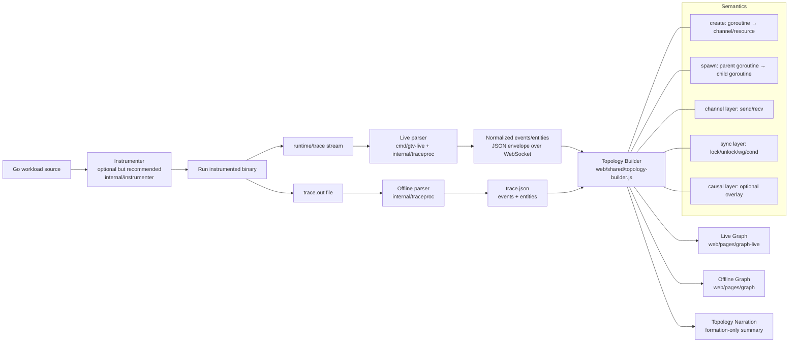

# Go Trace Visualizer (GTV)

GTV visualizes Go concurrency from `runtime/trace` in two modes:

- **Live replay** over WebSocket
- **Offline replay** from `trace.json`

It includes an instrumenter, a shared trace processor, and two graph viewers with synchronization-aware topology.

## Table of Contents

1. [What is GTV](#what-is-gtv)
2. [Current Architecture](#current-architecture)
3. [Quick Start](#quick-start)
4. [Core URLs and APIs](#core-urls-and-apis)
5. [Instrumentation Workflows](#instrumentation-workflows)
6. [Topology and Synchronization Model](#topology-and-synchronization-model)
7. [Viewer Features](#viewer-features)
8. [Sync Debug Validation Mode](#sync-debug-validation-mode)
9. [Repository Layout](#repository-layout)
10. [Testing](#testing)
11. [Troubleshooting](#troubleshooting)
12. [Key Configuration](#key-configuration)
13. [Contributing](#contributing)
14. [License](#license)

## What is GTV

Go Trace Visualizer is a tool for analyzing and visualizing Go concurrency patterns. It processes runtime trace data to reveal:

- **Goroutine relationships** (creation and spawning)
- **Channel communication** (send/receive operations)
- **Synchronization events** (mutexes, wait groups, condition variables)
- **Causal dependencies** between concurrent operations

GTV is designed for developers who want to understand, debug, and optimize concurrent Go programs.

## Current Architecture



### Key Characteristics

- **Web UI** located under `web/pages/*` (modern structure, not legacy flat HTML paths)
- **Synchronization-first** topology with sync events as first-class citizens (separate from channel transport)
- **Robust edge identification** using `seq`/`time_ns` to prevent link collapsing
- **Unified support** for both offline and live viewers with identical feature sets:
  - `Sync only` mode
  - Optional layer filters (Channel/Sync/Spawn/Causal)
  - Topology narration panel (Compact/Normal + copy functionality)
- **Instrument integration** supports loading generated workloads directly from `internal/workload`

## Quick Start

### Prerequisites

- Go 1.16 or later
- Node.js (for running tests)
- A web browser supporting WebSockets

### Live Mode (Recommended)

1. **Start the server:**

```bash
go run ./cmd/gtv-live
```

2. **Open in your browser:**

- Home page: `http://localhost:8080/` (redirects to start page)
- Direct: `http://localhost:8080/pages/index/index.html`

3. **Create and instrument a workload:**

Navigate to `/pages/instrument/instrument.html` and either:
- **Create Workload:** Write or paste your Go source code, then generate an instrumented version
- **Load Workload:** Choose from pre-built workloads in `internal/workload`

4. **View live trace:**

- Open `http://localhost:8080/pages/graph-live/graph-live.html`
- The live graph displays events as they occur with real-time updates

### Offline Mode

1. **Generate trace files:**

```bash
go run .
```

This produces:
- `trace.out` — raw runtime trace
- `trace.json` — processed events and entities

2. **Open offline viewer:**

- Navigate to `http://localhost:8080/pages/graph/graph.html`
- Load `trace.json` to visualize the complete trace

## Core URLs and APIs

### Web Pages

| Page | URL | Purpose |
|------|-----|---------|
| Start | `/pages/index/index.html` | Entry point and navigation |
| Instrument | `/pages/instrument/instrument.html` | Create and test instrumented workloads |
| Offline Viewer | `/pages/graph/graph.html` | Analyze pre-recorded traces |
| Live Viewer | `/pages/graph-live/graph-live.html` | Real-time trace visualization |
| Demo | `/pages/demo/demo.html` | Pre-built demonstration scenarios |

### Server Endpoints

| Method | Endpoint | Description |
|--------|----------|-------------|
| GET | `/trace` (WebSocket) | Live event stream for graph-live viewer |
| POST | `/instrument` | Instrument Go source code and generate workload |
| GET | `/workloads` | List all available workloads in `internal/workload` |
| GET | `/workload?name=<name>` | Fetch source of a specific workload |
| GET | `/run?...` | Run workload once and return timeline JSON |
| GET | `/demo/go-trace` | Open Go native trace flow |
| POST | `/clear-build-cache` | Clear runner build cache |

## Instrumentation Workflows

### Browser-Based Instrument Flow

From `/pages/instrument/instrument.html`:

1. **Create Workload:**
   - Paste or write your Go source code
   - Click **Create Workload**
   - Source is sent to `/instrument` endpoint
   - Generated file is saved to `internal/workload/<name>_gen.go`

2. **Load Workload:**
   - Click **Load Workload** to browse available workloads
   - Queries `/workloads` and `/workload` endpoints
   - Always loads from `internal/workload` directory

3. **Run and Visualize:**
   - Click **Run once** or open **Live graph** to see results

### Command-Line Instrument Flow

```bash
go run ./cmd/gtv-instrument -in ./your_main.go -name MyWork
```

**Important flags:**

| Flag | Default | Description |
|------|---------|-------------|
| `-outdir` | `internal/workload` | Output directory for generated workloads |
| `-level` | `regions` | Instrumentation level: `tasks_only`, `regions`, or `regions_logs` |
| `-sync-validation` | off | Enforce sync-safe preset (forces `regions_logs` + all sync features) |
| `-block-regions` | off | Enable block operation regions |
| `-goroutine-regions` | off | Enable goroutine creation regions |
| `-guard-labels` | off | Enable guarded label regions |
| `-value-logs` | off | Include value logging (increases trace volume) |
| `-io-regions` | off | Enable I/O operation regions |
| `-io-json` | off | Include JSON I/O details |
| `-io-db` | off | Include database I/O details |
| `-http-tasks` | off | Enable HTTP task tracking |
| `-grpc-tasks` | off | Enable gRPC task tracking |
| `-loop-regions` | off | Enable loop region tracking |

### Sync Validation Preset

When sync validation is enabled (UI preset or CLI `-sync-validation`):

- Level is forced to `regions_logs`
- Block regions are enabled
- Goroutine regions are enabled
- Guarded labels are enabled

This ensures comprehensive synchronization event capture for debugging race conditions and deadlocks.

## Topology and Synchronization Model

### Layer Contract

Topology links carry a `layer` attribute:

- **`channel`** — Send/receive on channels
- **`sync`** — Synchronization primitives (mutex, wait group, etc.)
- **`spawn`** — Parent-child goroutine relationships
- **`causal`** — Optional causal dependencies

The `kind` attribute is retained for styling and backward compatibility.

### Semantic Edge Rules

- **`create`** → `main goroutine` → `channel or resource`
- **`spawn`** → `parent goroutine` → `child goroutine`

### Sync Events

Parser/normalization preserves all synchronization events explicitly:

- `mutex_lock`, `mutex_unlock`
- `rwmutex_lock`, `rwmutex_unlock`, `rwmutex_rlock`, `rwmutex_runlock`
- `wg_add`, `wg_done`, `wg_wait`
- `cond_wait`, `cond_signal`, `cond_broadcast`

These are **not** flattened into generic channel semantics, allowing precise debugging.

## Viewer Features

### Live Viewer (`/pages/graph-live/graph-live.html`)

**Event Modes:**
- `teach` — Educational mode with detailed explanations
- `debug` — Technical debug mode with detailed timestamps and IDs

**Preset Controls:**
- **Sync View** — Quick preset for synchronization debugging

**Toggles:**
- `Commits` — Show commit operations
- `Attempts` — Show operation attempts
- `Causal` — Show causal dependencies
- `Messages only` — Display only message-based operations
- `Sync only` — Display only synchronization events

**Layer Filters** (enable with `?layers=1` or `?layer_filters=1`):
- Toggle individual layers (Channel/Sync/Spawn/Causal)

**Additional Features:**
- `Run HUD` — Execution status and controls
- `Debug / Audit` — Detailed event inspection
- `Download Events` — Export event data
- **Topology panel** — Summary of concurrency relationships (Compact/Normal format, copy to clipboard)
- Event buffer (default: 12,000 events, topology retained)

### Offline Viewer (`/pages/graph/graph.html`)

**Display Modes:**
- `Topology build` — Shows edges generated during topology phase
- `All events` — Displays complete event list

**Controls:**
- `Sync only` — Filter to synchronization events only
- Optional layer filters (same as live viewer)
- `Debug / Audit` — Detailed inspection of events
- **Topology narration panel** (Compact/Normal, copy)

## Sync Debug Validation Mode

**Recommended settings for synchronization debugging:**

Live viewer:
- `Events = debug`
- `Messages only = OFF`
- `Causal = ON`
- `Commits = ON`
- `Attempts = ON` (only when pairing ambiguity needs inspection)

**Fast path:**
1. Instrument page: Click **Sync Capture Preset**
2. Live page: Click **Sync View**

These presets automatically configure both instrumentation and viewer for optimal sync debugging.

## Repository Layout

```
.
├── cmd/
│   ├── gtv-live/main.go              # HTTP/WebSocket live server
│   ├── gtv-instrument/main.go         # CLI instrumenter
│   └── gtv-runner/                    # Workload runner entrypoint
├── internal/
│   ├── traceproc/                     # Shared trace processor
│   ├── instrumenter/                  # Source instrumentation pipeline
│   └── workload/                      # Built-in + generated workloads
├── web/
│   ├── pages/
│   │   ├── index/                     # Home page
│   │   ├── instrument/                # Instrument UI
│   │   ├── graph/                     # Offline viewer
│   │   ├── graph-live/                # Live viewer
│   │   └── demo/                      # Demo scenarios
│   └── shared/
│       ├── topology-builder.js        # Topology construction
│       ├── topology-description.js    # Narration generation
│       └── viewer-*.js                # Shared viewer utilities
├── main.go                            # Offline run + trace.out → trace.json
├── parser.go                          # Trace parsing logic
└── README.md
```

## Testing

Run the test suite to verify functionality after changes:

```bash
# Frontend tests
node web/shared/topology-builder.test.mjs
node web/shared/topology-description.test.mjs
node web/shared/viewer-layer-utils.test.mjs
node web/shared/viewer-renderer-integration.test.mjs

# Backend tests
go test ./internal/traceproc ./internal/instrumenter
```

## Troubleshooting

### Live page shows "Disconnected"

- Ensure the server is running: `go run ./cmd/gtv-live`
- Verify the page is served over `http://localhost:8080/...`
- Check browser console for WebSocket connection errors
- Firewall may be blocking WebSocket; check network settings

### No workloads listed in Instrument page

- Verify generated files exist in `internal/workload/*_gen.go`
- Check server output: `GET /workloads` response should list files
- Ensure you've clicked "Create Workload" or generated a workload via CLI

### Missing synchronization edges in viewer

- Use sync preset: instrument with `regions_logs` level + block regions enabled
- Switch live viewer to `Events = debug`
- Ensure `Messages only` is OFF
- Check that sync events are being captured in trace output

### Trace file is too large

- Disable value logs (enabled with `-value-logs` flag)
- Reduce trace duration or event scope
- Use offline mode for longer traces

### Browser performance issues with large traces

- Reduce event buffer size in live viewer
- Use `Sync only` or layer filters to limit displayed events
- Load traces incrementally if possible

## Key Configuration

### `cmd/gtv-live` Flags and Environment Variables

| Flag/Env | Default | Description |
|----------|---------|-------------|
| `-addr` / `GTV_ADDR` | `:8080` | Server listen address |
| `-workload` / `GTV_WORKLOAD` | — | Pre-load workload on startup |
| `-mode teach\|debug` / `GTV_MODE` | `teach` | Event display mode |
| `-timeout` / `GTV_TIMEOUT` | — | Execution timeout (also sets `GTV_TIMEOUT_MS`) |
| `-synth` / `GTV_SYNTH_SEND` | off | Synthetic send event generation |
| `-drop-block-no-ch` / `GTV_DROP_BLOCK_NO_CH` | off | Drop block events without channels |
| `-live-log` / `GTV_LIVE_LOG` | off | Enable detailed logging |
| `-mvp` / `GTV_MVP` | off | Classroom-friendly reduced UI mode |

### Trace Processor (`internal/traceproc`)

| Environment Variable | Default | Description |
|----------------------|---------|-------------|
| `GTV_FILTER_GOROUTINES` | — | Filter mode: `ops`, `all`, or `legacy` |
| `GTV_SKIP_PAIRING_CHANNELS` | off | Skip channel pair matching |
| `GTV_QUIESCENCE_MS` | — | Quiescence timeout for event batching |
| `GTV_DEADLOCK_WINDOW_MS` | — | Window for deadlock detection |
| `GTV_BLOCK_INFER_MS` | — | Time window for block inference |
| `GTV_SELECT_FALLBACK` | off | Use fallback select logic |

### Instrumenter (`internal/instrumenter`)

| Environment Variable | Description |
|----------------------|-------------|
| `GTV_INSTR_LEVEL` | Instrumentation level |
| `GTV_INSTR_GUARD_LABELS` | Enable guarded labels |
| `GTV_INSTR_GOROUTINE_REGIONS` | Enable goroutine regions |
| `GTV_INSTR_BLOCK_REGIONS` | Enable block regions |
| `GTV_INSTR_HTTP_TASKS` | Enable HTTP task tracking |
| `GTV_INSTR_GRPC_TASKS` | Enable gRPC task tracking |
| `GTV_INSTR_LOOP_REGIONS` | Enable loop regions |
| `GTV_LOG_VALUES` | Enable value logging |
| `GTV_INSTR_IO_REGIONS` | Enable I/O regions |
| `GTV_INSTR_IO_JSON` | Enable JSON I/O logging |
| `GTV_INSTR_IO_DB` | Enable database I/O logging |
| `GTV_INSTR_IO_HTTP` | Enable HTTP I/O logging |
| `GTV_INSTR_IO_OS` | Enable OS I/O logging |
| `GTV_INSTR_IO_ASSUME_BG` | Assume background I/O operations |
| `GTV_INSTR_CONFIG` | Custom instrumenter configuration |
| `GTV_MVP` | Classroom-friendly mode |

## Contributing

Contributions are welcome! Please follow these guidelines:

1. **Report Issues:** Use GitHub Issues to report bugs or suggest features
2. **Code Style:** Follow Go conventions for backend code and JavaScript standards for frontend
3. **Testing:** Add tests for new features and run existing tests before submitting PRs
4. **Documentation:** Update this README and code comments for significant changes

## Notes

- **MVP Mode:** Enable with `GTV_MVP=1` for a reduced, classroom-friendly configuration suitable for educational settings
- **Value Logs:** Optional and can significantly increase trace volume—use only when needed for debugging
- **Non-terminating Runs:** Supported through timeout/signal hooks that flush traces. Set `GTV_TIMEOUT_MS` for automatic timeout in instrumented workloads
- **Runtime Ordering:** `time_ns` is the authoritative trace timestamp; `seq` is the authoritative live arrival order index

## License

[Add your license information here]

---

**Last updated:** 2026-03-15